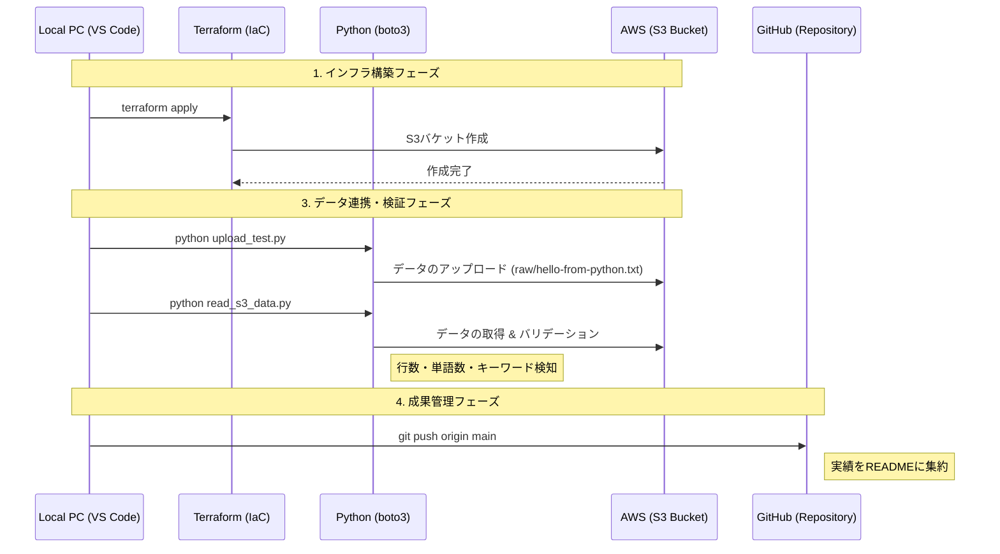

-----

# ☁️ 01\_DEA: AWS Certified Data Engineer - Associate

このセクションでは、AWSを用いたデータエンジニアリングの実装と、DEA資格合格に向けた技術検証を記録します。

## 🎯 学習テーマ

  - **IaC (Infrastructure as Code)**: Terraformを用いたデータ基盤の自動構築。
  - **データ連携 (SDK)**: Python (boto3) を用いたインフラ操作とデータ投入・取得の自動化。
  - **データレイク構築**: S3を中心としたスケーラブルなストレージ設計。
  - **データ品質保証**: 取得データの統計的バリデーションの実装。

## 📂 構成 (Directory Structure)

  - [**infrastructure/**](01_DEA/infrastructure): TerraformによるAWSリソースの定義。
  - [**src/**](01_DEA/src): データ転送・操作・バリデーション用のPythonスクリプト。
  - **docs/images/**: 構築および実行エビデンス（スクリーンショット）。

-----

## 🛠️ 実装プロジェクト: S3 Data Lake Foundation

### 1\. 概要

Terraformで構築したS3バケットに対し、Python (boto3) を用いてプログラム経由でデータを投入し、さらにそのデータを取得して内容の整合性を自動チェックするパイプラインの基礎を構築しました。

### 2\. 処理フロー (Mermaid)

### 3\. 実行エビデンス (Sprint 1)

#### 🚀 インフラ構築とデータ投入

手動操作を一切排除し、構築から投入までを「コード」で完結させています。

| 項目 | エビデンス画像 |
| :--- | :--- |
| **Terraform Apply ログ** |[Terraform Apply Log](infrastructure/docs/images/terraform_apply_log.png)|
| **アップロード成功ログ** |[Terraform Upload Log](infrastructure/docs/images/uploadlog.png)|
| **AWSコンソール確認** |[Terraform Upload Log](infrastructure/docs/images/aws-s3-console3.png)|

#### 🔍 データの取得とバリデーション

取得したデータに対し、プログラムによる自動検証（品質保証）を実施したログです。

| 項目 | 内容 | 実行ログ |
| :--- | :--- | :---: |
| **S3 Read & Validation** | 行数、単語数、キーワード "Python" の含有チェック |[Terraform Upload Log]([S3 Read & Validation](infrastructure\docs\images\s3_read_success.png)|

-----

> **Summary**:
> インフラの再現性（IaC）とデータの整合性（Validation）をコードで担保する基盤を確立しました。検証完了後は `terraform destroy` を実行し、クラウドコストの最適化を徹底しています。

-----
