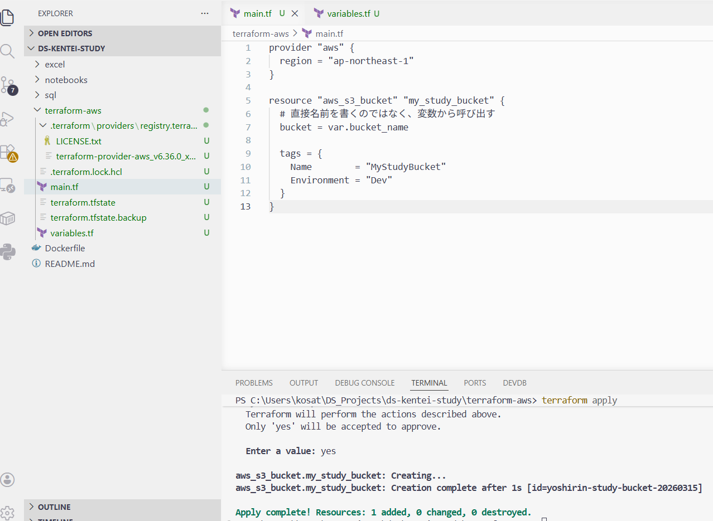
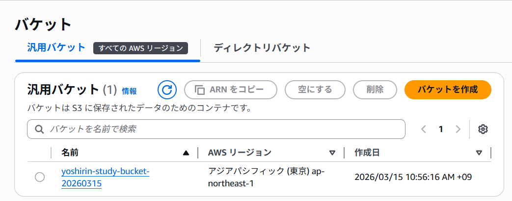
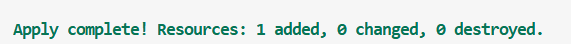
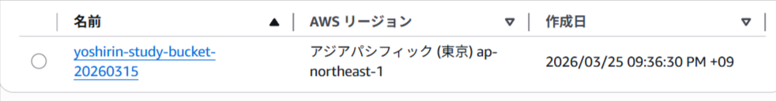

# ☁️ 01_DEA: AWS Certified Data Engineer - Associate

このセクションでは、AWSを用いたデータエンジニアリングの実装と、DEA資格合格に向けた技術検証を記録します。

## 🎯 学習テーマ
- **IaC (Infrastructure as Code)**: Terraformを用いたデータ基盤の自動構築。
- **データレイク構築**: S3を中心としたスケーラブルなストレージ設計。
- **データ統合**: AWS GlueによるETL処理とカタログ管理（予定）。
- **分析基盤**: Amazon Athenaを用いたサーバーレスなクエリ実行（予定）。

## 📂 構成 (Directory Structure)
- `infrastructure/`: TerraformによるAWSリソースの定義。
- `src/`: データ転送・加工用のPythonスクリプト。
- `images/`: 構築エビデンス（スクリーンショット）。

---

## 🛠️ 実装プロジェクト: S3 Data Lake Foundation

### 1. 概要
Terraformを使用して、データレイクの基盤となるS3バケットを自動構築しました。

### 2. 工夫した点
- **変数の分離**: `variables.tf` を活用し、バケット名やリージョンを柔軟に変更可能に設計。
- **Git管理の最適化**: 巨大なバイナリファイルや状態ファイルを `.gitignore` で適切に除外し、軽量なリポジトリを維持。

### 3. エビデンス
#### Terraformによるリソース構築

#### AWSコンソールでの実体確認

## 🛠️ Data Engineering: Infrastructure as Code (IaC)

### 01_DEA/infrastructure
AWSのデータレイク基盤をTerraformで構築・管理しています。

- **使用技術**: Terraform (v1.x), AWS (S3)
- **実施内容**: 
  - S3バケットの自動プロビジョニング
  - `.gitignore` によるステートファイル（機密情報）の厳格な管理
  - 変数（`variables.tf`）を利用した環境の柔軟な切り替え

#### 🚀 実行エビデンス
Terraformによって1秒でリソースが生成されることを確認済みです。

| Terraform Apply ログ | AWS コンソール確認 |
| :---: | :---: |
|  |  |