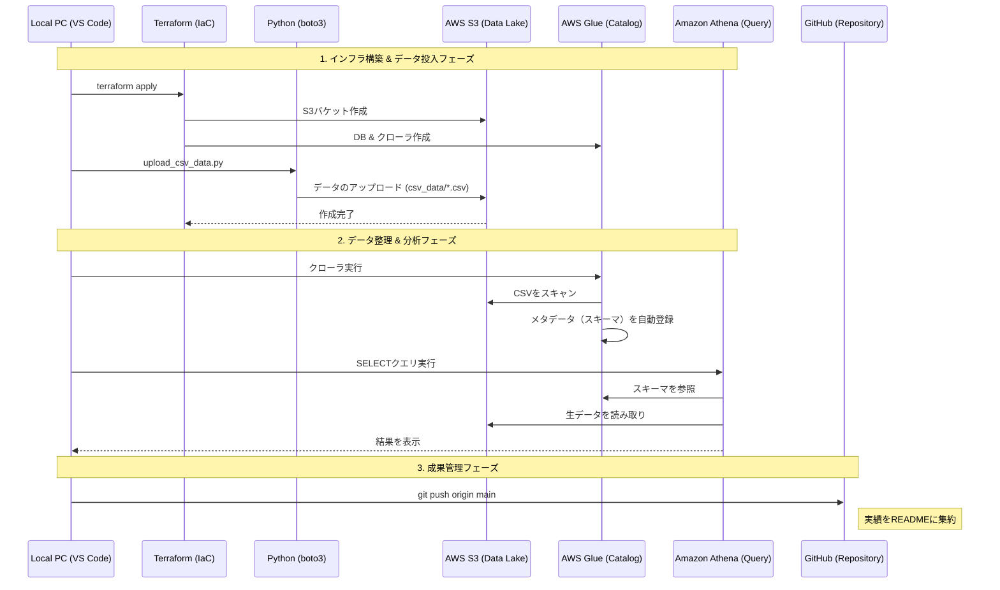

-----

# ☁️ 01\_DEA: AWS Certified Data Engineer - Associate

このリポジトリでは、AWSを用いたモダン・データエンジニアリングの実装と、DEA資格合格に向けた技術検証を記録します。

## 🎯 学習テーマ

  - **IaC (Infrastructure as Code)**: Terraformを用いた、再現可能かつ冪等なデータ基盤の自動構築。
  - **データ連携 (SDK)**: Python (boto3) を用いた、インフラ操作とデータレイクへのデータ投入・取得の自動化。
  - **データレイク構築**: S3を中心としたスケーラブルで疎結合なストレージ設計。
  - **データ品質保証 (Data Quality)**: 取得データに対する、プログラムベースの統計的バリデーションの実装。
  - **サーバーレス分析**: Glue/Athenaを活用した、スキーマ自動管理とSQLによるオンデマンド分析。

## 📂 構成 (Directory Structure)

- **infrastructure/**: TerraformによるAWSリソース（S3, Glue, IAM）の定義。
- **src/**: データ転送、バリデーション、バッチ処理用のPythonスクリプト。
- **docs/images/**: 構築および実行エビデンス（スクリーンショット）。

-----

## 🛠️ 実装プロジェクト: Modern Data Lake Pipeline

### 1\. プロジェクト概要

データエンジニアリングのベストプラクティスに基づき、インフラの自動化（Terraform）、データのパイプライン化（Boto3/Python）、そしてサーバーレス分析（Glue/Athena）を統合した基盤を構築しました。手動操作を完全に排除し、コードベースでデータレイクの全ライフサイクルを管理することを目標とします。

### 2\. 処理フロー (Mermaid)

### 3\. 実行エビデンス (Sprint 1: S3 Foundation)

#### 🚀 インフラ構築とデータ投入

手動操作を一切排除し、構築から投入までを「コード」で完結させています。

| 項目 | エビデンス画像 |
| :--- | :--- |
| **Terraform Apply ログ** |  |
| **アップロード成功ログ** |  |
| **AWSコンソール確認** |  |
| **S3 Read & Validation** |  |

#### 🔍 データの取得とバリデーション

取得したデータに対し、プログラムによる自動検証（品質保証）を実施したログです。

| 項目 | エビデンス画像 |
| :--- | :--- |
| **S3 Read & Validation** |  |

> **Summary (Sprint 1)**:
> インフラの再現性（IaC）とデータの整合性（Validation）をコードで担保する基盤を確立しました。

-----

### 4\. 実行エビデンス (Sprint 2: Batch Processing)

#### 🚀 複数ファイルの一括スキャンとバリデーションのスケール

1つのファイル指定から、バケット内の全オブジェクトを自動検知して処理するスケーラブルなパイプラインへ進化させました。

| 項目 | エビデンス画像 |
| :--- | :--- |
| **S3コンソール (ファイル一覧)** |  |
| **一括スキャン実行ログ** |  |

> **Summary (Sprint 2)**:
> `list_objects_v2` を活用し、データ量の増加に対応可能な検知ロジックを実装。特定のキーワードに基づく品質チェックを全件自動で実施できることを確認しました。

-----

### 5\. 実行エビデンス (Sprint 3: Modern Data Stack Integration)

#### 🚀 Glueによるカタログ化とAthenaでのサーバーレス分析

S3上の生データをAWS Glueで自動スキャン（Schema Discovery）し、Amazon Athenaを用いてSQLで分析するモダンなパイプラインを統合しました。

| 項目 | 内容 | エビデンス画像 |
| :--- | :--- | :--- |
| **Glue Schema Discovery** | CSVから `id`, `topic`, `status` を抽出 |  |
| **Athena SQL Query** | S3上のデータをSQLで直接抽出 |  |
| **動的更新 (120%達成)** | インフラ変更なしで新規データ反映 |  |

> **Summary (Sprint 3)**:
> 「スキーマ・オン・リード」を実現。データの構造をGlue Data Catalogで一元管理することで、S3を「クエリ可能なデータベース」として活用する、疎結合で強力な分析基盤を確立しました。データの追加に対して分析側が自動追従することを確認し、パイプラインの動的な連携を実証しました。

-----

> **Summary (Project Total)**:
> 本プロジェクトを通じて、AWSを用いたサーバーレス・データ分析基盤の設計・構築・運用に必要となる、IaC、SDK、ETL/カタログ管理、SQL分析の主要スキルを統合的に実証しました。

-----