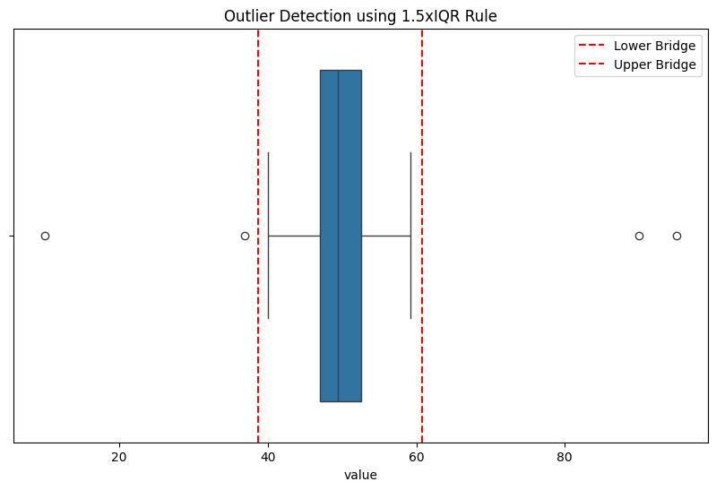
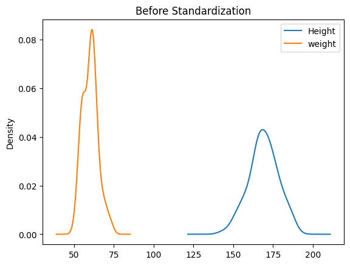
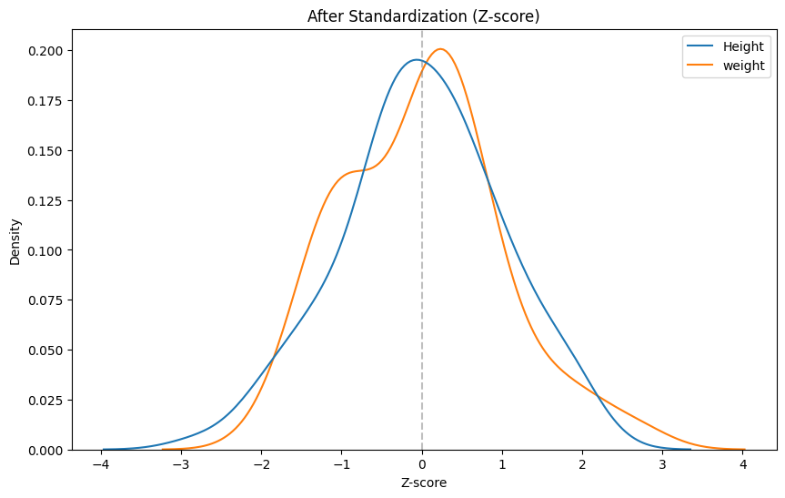
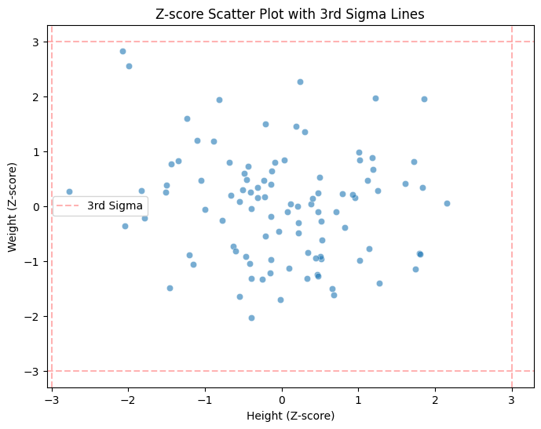

# 📊 02_Statistics_L2: Statistics for Data Science

このセクションでは、統計検定2級およびデータサイエンス実務に必要な統計学的解析手法の学習と実装を記録します。

## 🎯 学習テーマ
- **データの記述**: 四分位数（Quartiles）や標準偏差を用いた分布の把握。
- **異常値検知**: 1.5xIQRルールおよび3σ法に基づく客観的な外れ値の特定。
- **データの標準化**: 異なる尺度（単位）を持つデータの無次元化と正規化。

---

## 🛠️ 実装プロジェクト1: 1.5xIQRによる外れ値検知

### 1. 概要
中央50%のデータ範囲（IQR）から算出される境界線に基づき、データのヒゲ（Whisker）を越える極端な値を「外れ値」として特定するロジックを実装しました。

### 2. 数学的定義
第一四分位数を $Q_1$、第三四分位数を $Q_3$ とし、四分位範囲を $IQR = Q_3 - Q_1$ と定義。
$$Lower\ Bridge = Q_1 - 1.5 \times IQR$$
$$Upper\ Bridge = Q_3 + 1.5 \times IQR$$

### 3. 解析結果（エビデンス）
計算により求めた境界線（赤点線）を箱ひげ図にプロット。データの分布を客観的に評価し、異常候補を視覚的に分離しました。

---

## 🛠️ 実装プロジェクト2：標準化（Z-score）と3σ法

### 1. 概要
身長（cm）と体重（kg）のようにスケールが異なる変数を同一の基準で比較するため、データを標準化。あわせて正規分布の性質を利用した「3σ法」による異常検知プロセスを構築しました。

### 2. 数学的背景
#### 標準化（Z-score）
データを平均0、標準偏差1の標準正規分布に近似させ、相対的な位置を算出します。
$$z = \frac{x - \mu}{\sigma}$$

#### 3σ（シグマ）法
平均から $\pm3\sigma$ 以内に全データの **99.7%** が含まれる性質を利用し、$|Z| > 3$ を統計的異常と判定します。

### 3. 解析結果（エビデンス）
- **標準化によるスケール統合**: 
  Before（左）では単位差により分離していた分布が、After（右）では共通のZ-score軸上に統合され、変数の重なり具合や偏りを直接比較可能になりました。

| Before Standardization | After Standardization |
| :---: | :---: |
|  |  |

- **3σ境界線による多変量評価**: 
  標準化後の散布図に境界線（$Z = \pm 3$）を描画。統計的正常範囲（3σ以内）を視覚的に定義しました。

