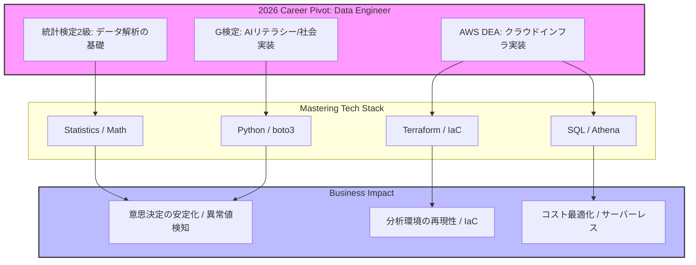
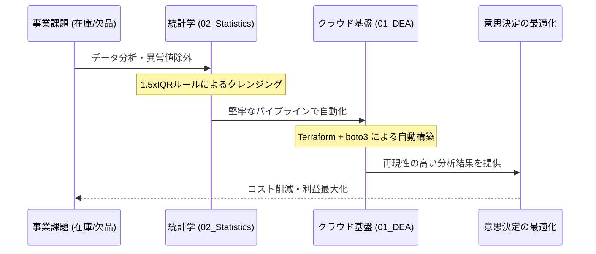
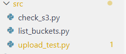
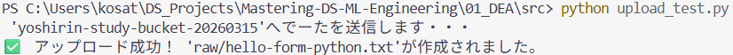
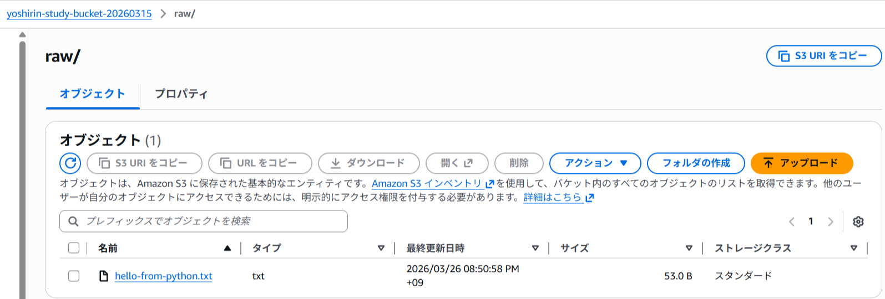

# 🎓 Mastering Data Science & ML Engineering
### (Old: DS-Study-Log)

データエンジニア（DE）へのキャリア転換を目指し、統計学の基礎からクラウドインフラの実装までを体系的に記録するリポジトリです。

---

## 📌 コンセプト
**「単なる暗記ではなく、実務に繋がる実装力を」**
NotebookLM等のAIツールで構造化した知識を、TerraformやPythonを用いて「動く形」で再構成しています。

## 📂 ディレクトリ構成
実務のMLOps環境に準拠し、各資格・プロジェクトを独立して管理しています。
- `01_DEA/`: AWSデータエンジニアリング関連の実装（旧 `terraform-aws/`）
- `02_Statistics_L2/`: 統計学の理論検証（旧 `excel/` `notebooks/`）
- `03_G_Kentei/`: AIリテラシー・社会実装・法律関連
- `04_E_Shikaku/`: 深層学習のアルゴリズム実装
- `shared/`: 共通スクリプト、過去のアーカイブ (`old_notes`)

## 🚀 現在の目標
- **統計検定2級合格**: 2026年内の取得を目指し、弱点の統計学を重点的に強化。
- **G検定合格**: 深層学習の理論と社会実装の基礎を習得。
- **DEA合格**: データエンジニアとしての基本であるSQLおよびTerraformの強化。

---

## 🚀 プロジェクトのビジネス価値
本リポジトリで取り組む技術スタックは、以下の具体的な事業課題の解決を想定しています。

### 1. データクレンジングによる意思決定の安定化 (`02_Statistics_L2/`)
- **課題**: センサー故障や入力ミスによる異常値が、予測精度を著しく低下させていた。
- **解決**: 1.5xIQRルールに基づき、異常値を自動的に除去・補正するモジュールを実装。
- **価値**: 予測のブレを最小化し、不要な在庫コスト削減や欠品リスク低減に貢献します。

### 2. 堅牢なインフラによる分析環境の再現性 (`01_DEA/`)
- **技術**: AWS / Terraform / Docker
- **価値**: インフラをコード化（IaC）することで、チーム全体が同一の分析環境を即座に構築でき、プロジェクトの立ち上げスピードを最大化します。

---

## ☁️ Engineering Highlights: AWS Automation (DEA)

Terraformを用いてAWS S3バケットを構築・管理。実務を意識したリファクタリングを実践。

### 🛠 実装のこだわり
- **IaC (Infrastructure as Code)**: 手動操作を排除し、再現性の高いインフラ構築を実現。
- **Variablesの活用**: `variables.tf` による変数分離を実装し、保守性を向上。
- **セキュリティ・マナーの徹底**: `.gitignore` を活用し、機密情報や不要なバイナリ（800MB超のprovider等）を適切に管理・排除。

### ⚡ トラブルシューティング（学びの記録）
1. **GitHubのファイルサイズ制限への対応**: 
   - 誤ってGit管理に含めたプロバイダーの巨大バイナリによるエラーを経験。`git reset` と `.gitignore` 設定によりレポジトリをクリーンな状態に修正し、Git運用の作法を習得。
2. **Terraform最新構文への対応**:
   - 型指定における非推奨な記述を、エラーログに基づき最新の記述（引用符の排除）へ修正。

### 🎥 デプロイ・エビデンス

#### 1. Terraformによるリソース構築
 VS Code上のターミナルから `terraform apply` を実行し、AWS S3リソースが正常にプロビジョニングされる様子です。

 | VSCodeディレクトリ構成 | アップロード成功ログ |
 | :---: | :---: |
 |  |  |

#### 2. AWSコンソールでの実体確認
 プログラム（boto3）経由で作成されたフォルダおよびファイルが、クラウド上に正しく反映されていることをコンソール上で確認しました。

 | S3バケット内のオブジェクト一覧 |
 | :---: |
 |  |

---

© 2026 Moheji / Data Engineer Aspirant
